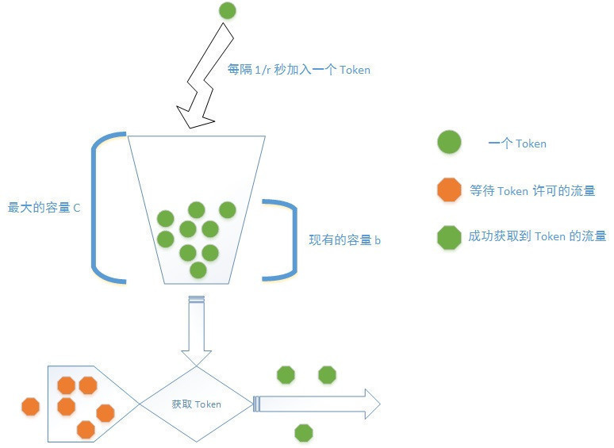

# ratelimiter

token bucket 请求限频的简单版实现，支持进程内存和 redis 分布式限频（以及 gin 中间件）

- 提供 lua + nginx + redis 的上层分布式级别的令牌桶限频实现： [lua-ngx-ratelimiter](./lua-ngx-ratelimiter)
- 提供 [rate](https://github.com/golang/time/tree/master/rate) + [go-cache](https://github.com/patrickmn/go-cache)
  的封装 [MemRatelimiter](./mem_ratelimiter.go)
- 提供 redis + lua 的 [RedisRatelimiter](./redis_ratelimiter.go)
- 提供进程内存级别的令牌桶限频 gin 中间件： [GinMemRatelimiter](./gin_mem_ratelimiter.go)
- 提供 redis 分布式级别的令牌桶限频 gin 中间件： [GinRedisRatelimiter](./gin_redis_ratelimiter.go)

## go pkg 安装

```
go get -u github.com/uhonliu/go-ratelimiter
```

## Gin Middleware 用法

**[GinMemRatelimiter](./example/gin_mem_ratelimiter.go)**

```
package main

import (
	"time"

	"github.com/uhonliu/go-ratelimiter"
	"github.com/gin-gonic/gin"
)

func main() {
	r := gin.New()
	// Put a token into the token bucket every 1s
	// Maximum 1 request allowed per second
	r.Use(ratelimiter.GinMemRatelimiter(ratelimiter.GinRatelimiterConfig{
		// config: how to generate a limit key
		LimitKey: func(c *gin.Context) string {
			return c.ClientIP()
		},
		// config: how to respond when limiting
		LimitedHandler: func(c *gin.Context) {
			c.JSON(200, "too many requests!!!")
			c.Abort()
			return
		},
		// config: return ratelimiter token fill interval and bucket size
		TokenBucketConfig: func(*gin.Context) (time.Duration, int) {
			return time.Second * 1, 1
		},
	}))
	r.GET("/", func(c *gin.Context) {
		c.JSON(200, "hi")
	})
	r.Run()
}
```

**[GinRedisRatelimiter](./example/gin_redis_ratelimiter.go)**

```
package main

import (
	"time"

	"github.com/uhonliu/go-utils"
	"github.com/uhonliu/go-ratelimiter"
	"github.com/gin-gonic/gin"
	"github.com/go-redis/redis/v8"
)

func main() {
	r := gin.New()
	// Put a token into the token bucket every 1s
	// Maximum 1 request allowed per second
	rdb, err := goutils.NewRedisClient(&redis.Options{})
	if err != nil {
		panic(err)
	}
	r.Use(ratelimiter.GinRedisRatelimiter(rdb, ratelimiter.GinRatelimiterConfig{
		// config: how to generate a limit key
		LimitKey: func(c *gin.Context) string {
			return c.ClientIP()
		},
		// config: how to respond when limiting
		LimitedHandler: func(c *gin.Context) {
			c.JSON(200, "too many requests!!!")
			c.Abort()
			return
		},
		// config: return ratelimiter token fill interval and bucket size
		TokenBucketConfig: func(*gin.Context) (time.Duration, int) {
			return time.Second * 1, 1
		},
	}))
	r.GET("/", func(c *gin.Context) {
		c.JSON(200, "hi")
	})
	r.Run()
}
```

## Ratelimiter 可以直接在 golang 程序中使用，用法示例：

**[MemRatelimiter](./example/mem_ratelimiter.go)**

```
package main

import (
	"context"
	"fmt"
	"time"

	"github.com/uhonliu/go-ratelimiter"
)

func main() {
	limiter := ratelimiter.NewMemRatelimiter()
	limitKey := "uniq_limit_key"
	tokenFillInterval := time.Second * 1
	bucketSize := 1
	for i := 0; i < 3; i++ {
		// 1st and 3nd is allowed
		if i == 2 {
			time.Sleep(time.Second * 1)
		}
		isAllow := limiter.Allow(context.TODO(), limitKey, tokenFillInterval, bucketSize)
		fmt.Println(i, time.Now(), isAllow)
	}
}
```

**[RedisRatelimiter](./example/redis_ratelimiter.go)**

```
package main

import (
	"context"
	"fmt"
	"time"

	"github.com/uhonliu/go-utils"
	"github.com/uhonliu/go-ratelimiter"
	"github.com/go-redis/redis/v8"
)

func main() {
	rdb, err := goutils.NewRedisClient(&redis.Options{})
	if err != nil {
		panic(err)
	}

	limiter := ratelimiter.NewRedisRatelimiter(rdb)
	limitKey := "uniq_limit_key"
	tokenFillInterval := time.Second * 1
	bucketSize := 1
	for i := 0; i < 3; i++ {
		// 1st and 3nd is allowed
		if i == 2 {
			time.Sleep(time.Second * 1)
		}
		isAllow := limiter.Allow(context.TODO(), limitKey, tokenFillInterval, bucketSize)
		fmt.Println(i, time.Now(), isAllow)
	}
}
```

## 关于令牌桶（ token bucket ）

令牌桶限流的原理是系统以一个恒定的速度往固定容量的桶里放入令牌，当有请求进来时，需要先从桶里获取并消耗一个令牌，当桶里没有令牌可取时，则拒绝服务或让请求等待。

如图：



每隔 1/r 秒向 bucket 中填充一个 token ； bucket 最多只能存放 b 个 token ，如果填充 token 时 bucket 已经满了，这丢弃这个 token ； 当请求到达时，从 bucket 获取并消耗一个
token ，并处理请求； 如果 bucket 中的 token 数不足，则不消耗 token ，直接拒绝处理本次请求。

在取 token 时可以通过计算上次取跟这次取之间按照速率会产生多少个 token 加上上次剩余的 token ，然后比较剩余 token 数来替代使用一个线程支持在后台持续更新 token 的方案来避免性能问题。

参考文章：

- [Wikipedia](https://en.wikipedia.org/wiki/Token_bucket)
- [百度百科](https://baike.baidu.com/item/令牌桶算法)
- [令牌桶算法](https://support.huawei.com/enterprise/zh/doc/EDOC1100055155/33f24bb0)
- [流量整形以及漏桶、令牌桶算法](http://www.tkorays.com/2019/04/05/tracffic-shaping-and-bucket-algorithm/)
- [rate limiting 之 token bucket](https://mozillazg.com/2019/01/rate-limiting-intro-token-bucket.html#id8)
- [API 调用次数限制实现](https://zhuanlan.zhihu.com/p/20872901)

## 关于实现

在采用 Redis + Lua 实现限流方案时，利用 Redis 的 EVAL 命令的原子性来保证令牌桶相关运算逻辑在对 token 进行加减计算时的并发安全。

Redis 的 EVAL 命令可以执行 Lua 脚本内容，将需要执行的 Lua 代码以字符串内容的形式传入，并传入脚本内容需要的相关参数， Redis 会使用单个 Lua 解释器去运行所有脚本，并且 Redis 也保证脚本会以原子性(
atomic)的方式执行：当某个脚本正在运行的时候，不会有其他脚本或 Redis 命令被执行，以此保证脚本逻辑中的运算结果的并发安全。

是否限流是 Lua 通过在 Redis 中运行 Lua 脚本来计算相关的 token 数量， Lua 通过 Redis 计算的结果来判断是否需要继续处理请求。

在 Redis 中运行 Lua 脚本时，如果报错

```
Write commands not allowed after non deterministic commands.
Call redis.replicate_commands() at the start of your script in order to switch to single commands replication mode.
```

是因为 Redis 出于数据一致性考虑，要求脚本必须是纯函数的形式，也就是说对于一段 Lua 脚本给定相同的参数，重复执行其结果都是相同的。

这个限制的原因是 Redis 不仅仅是单机版的内存数据库，它还支持主从复制和持久化，执行过的 Lua 脚本会复制给 slave 以及持久化到磁盘，如果重复执行得到结果不同，那么就会出现内存、磁盘、 slave 之间的数据不一致，在
failover 或者重启之后造成数据错乱影响业务。

如果执行过非确定性命令（令牌桶算法需要获取时间也就是执行 TIME ，TIME 结果会随时间变化，是一个随机命令）， Redis 就不允许执行写命令，以此来保证数据一致性。在低版本的 Redis 中默认不允许进行随机写入，所以报错。

解决办法是在脚本最开始的位置加上 `redis.replicate_commands()`，这样 Redis 就不再是把整个 Lua 脚本同步给 slave 和持久化，而是只把脚本中的写命令使用 multi/exec
包裹后直接去做复制，那么 slave 和持久化只复制了写命令，而写入的也是确定的结果。

Redis 中一共有 10 个随机类命令： spop 、 srandmember 、 sscan 、 zscan 、 hscan 、 randomkey 、 scan 、 lastsave 、 pubsub 、 time
