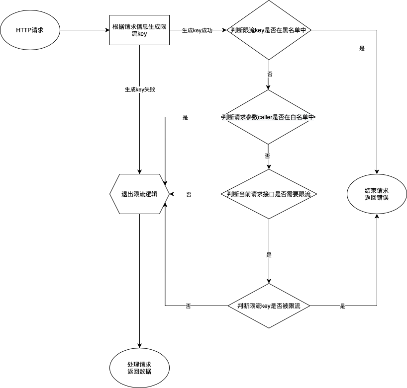

# lua-ngx-ratelimiter (nginx + lua + redis + token bucket) 请求限流

根据 `host 前缀 + 接口 URI + 请求来源 IP + 请求参数` 进行限流

## 业务流程：



## 代码文件说明：

- `conf/nginx.conf` 为开发调试时使用的示例 nginx 配置文件
- `blocked_keys_config.lua` 为限流黑名单 key 配置文件，命中黑名单拒绝后续请求逻辑
- `caller_whitelist_config.lua` 为 caller 参数白名单配置文件， caller 参数值命中则不限流
- `key.lua` 为限流 key 相关的逻辑实现，包括：根据请求生成 key ， 判断 key 是否命中黑名单、白名单，等等。
- `limited_api_config.lua` 为需要限流 api 名称配置文件，只针对其中配置 api 进行限流
- `main.lua` 为限流入口脚本，实现限流判断逻辑，被 nginx 配置文件加载。
- `redis_config.lua` 为单独存放的 redis 相关的配置，可单独下发修改，用于控制 redis 的连接，配置项参考代码注释
- `token_bucket.lua` 为 token bucket 限流算法的相关实现
- `token_bucket_config.lua` 为单独存放的 token bucket 相关的配置，可单独下发修改，用于控制限流频率等，配置项参考代码注释
- `utils.lua` 为通用工具类函数。

## 本地开发与调试

安装 openresty: <https://openresty.org/cn/installation.html>

启动服务：在当前目录执行

```
./dev/start.sh
```

停止服务：

```
./dev/stop.sh
```

修改后重新加载服务：

```
./dev/reload.sh
```

启动服务或 reload 服务后的请求调试：

```
# 普通正常 post 请求，不在 limited_api_config 中，不会触发限频逻辑
# 正常返回 hello world
curl -H "host:gz.qq.com" http://localhost:8080/_dev_api -H "content-type:application/json" -d '{"seqId": "xx-xx-xx", "caller":"_dev_ashin"}'

# 普通正常 get 请求，不在 limited_api_config 中，不会触发限频逻辑
# 正常返回 hello world
curl -H "host:gz.qq.com" "http://localhost:8080/_dev_api?seqId=xx-xx-xx&caller=_dev_ashin"

# 请求生成的 key 触发黑名单 (key 对应 blocked_keys_config 中的 `ratelimiter:gz:/api/blocked:uhonliu:127.0.0.1`)
# 返回对应的错误 json
curl -H "host:gz.qq.com" http://localhost:8080/_dev_api/blocked -H "content-type:application/json" -d '{"seqId": "xx-xx-xx", "caller":"_dev_uhonliu"}'

# 请求的 uri 匹配 limited_api_config 中的 `/_dev_api/limited` 触发限频逻辑
# caller 和 uri 不匹配 token_bucket_config 中的配置，应该采用 default 配置
curl -H "host:gz.qq.com" http://localhost:8080/_dev_api/limited -H "content-type:application/json" -d '{"seqId": "xx-xx-xx", "caller":"mayday"}'
# 触发特殊限流配置 每秒只能访问一次 快速手动执行可以触发限频 返回对应的错误 json
curl -H "host:gz.qq.com" http://localhost:8080/_dev_api/limited -H "content-type:application/json" -d '{"seqId": "xx-xx-xx", "caller":"_dev_ashin"}'

# 请求参数 caller 触发白名单 （ caller 对应 caller_whitelist_config 中的 _dev_whitelist ），即使是请求限流接口也不会触发限频逻辑
# 正常返回 hello world
curl -H "host:gz.qq.com" http://localhost:8080/_dev_api/limited -H "content-type:application/json" -d '{"seqId": "xx-xx-xx", "caller":"_dev_whitelist"}'
```

## 相关配置操作

所有`_config.lua` 结尾的代码文件都是是用于配置的

### 新增限流接口: 修改 [limited_api_config.lua](./limited_api_config.lua)

必须在配置中设置接口 uri 后该接口才会进行限流检查，请求接口的 URI 不在该配置中则不会进入限流逻辑

参照示例，将 `_M` 的 `key` 设为接口 `URI` ， `value`设置为`1`，这样对应 uri 的请求就会进行限流检查

### 设置 caller 参数白名单：修改 [caller_whitelist_config.lua](./caller_whitelist_config.lua)

caller 白名单中参考示例添加对应的 caller 值后，在限流的接口请求中不触发限流逻辑

### 设置限流 key 黑名单： 修改 [blocked_keys_config.lua](./blocked_keys_config.lua)

参照示例，将 `_M` 的 `key` 设为对应的限流 key ， `value`设置为`1`，这样请求生成的限流 key 存在于该配置中则会直接返回请求，不会进入后续逻辑

限流 key 生成规则： 固定前缀 `ratelimiter` 加上 `host 前缀 + caller 参数 + 接口 URI + 请求来源 IP`，并以分隔符 `:`分隔连接

限流 key 形如：`ratelimiter:region:uri:caller:clientip`

### 对特定 caller 的请求接口进行单独设置限流阈值：修改 [token_bucket_config.lua](./token_bucket_config.lua)

配置中的 `default` 是全局默认的限流阈值，示例为真的每个限流 key 设置为 500 次/秒，超过则返回错误信息

支持对特定 caller 参数和接口 uri 的组合调整为不同的阈值，`_M` 中 `key` 设置为 `caller` + `:` + `uri`， `value` 设置为 `1`， 这样即可设置该 caller 对该 uri
的请求进行单独的限流阈值设置
